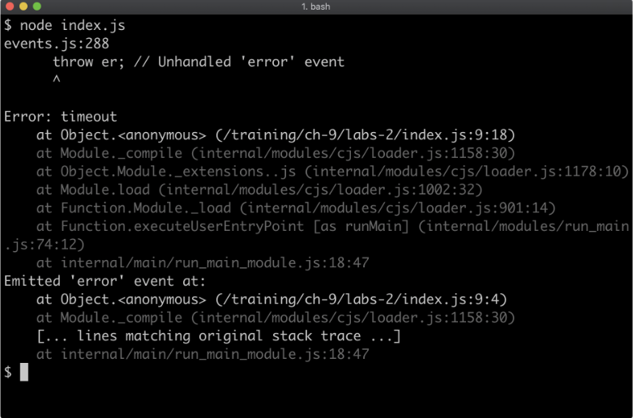

# WiTI-Education--NodeJS-Certification--Capitulo-9

## Lab 9.1 - Single Use Listener
The labs-1 index.jsfile contains the following code:
```javascript
'use strict'
const assert = require('assert')
const { EventEmitter } = require('events')

const ee = new EventEmitter()
let count = 0setInterval(() => {
    ee.emit('tick')
    }, 100)
function listener () {
    count++setTimeout(() => {
        assert.equal(count, 1)
        assert.equal(this, ee)
        console.log('passed!')
    }, 250)
}
```
Register the listener function with the ee event emitter in such a way that the listener function is only called a single time. If implemented correctly, the program should print outpassed!

## Implementing a Timeout Error

The labs-2 folder has an index.js file containingthe following
 ```javascript
'use strict'
const { EventEmitter } = require('events')
process.nextTick(console.log, 'passed!')
const ee = new EventEmitter()
ee.emit('error', Error('timeout'))
```
Currently the process crashes:


<br><br><br>
Without removing any of the existing code, and without using atry/catch block add some code which stops the process from crashing. When implemented correctly the process shouldoutputpassed!.